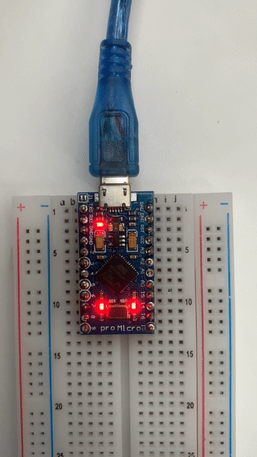
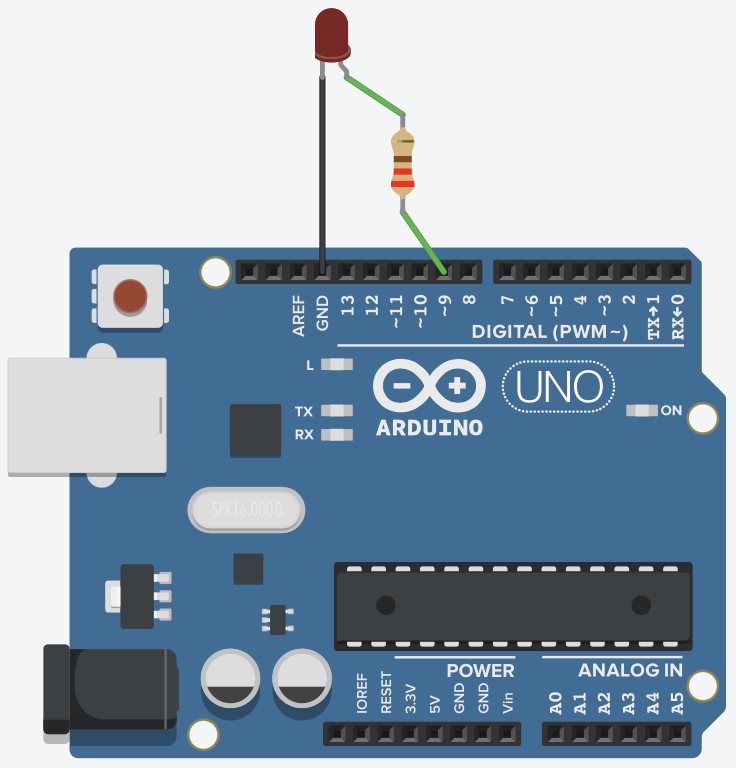
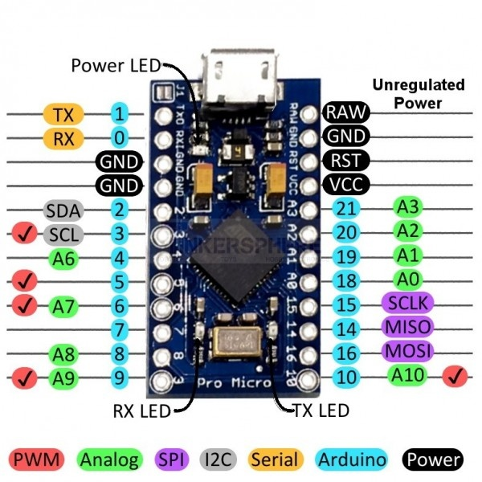
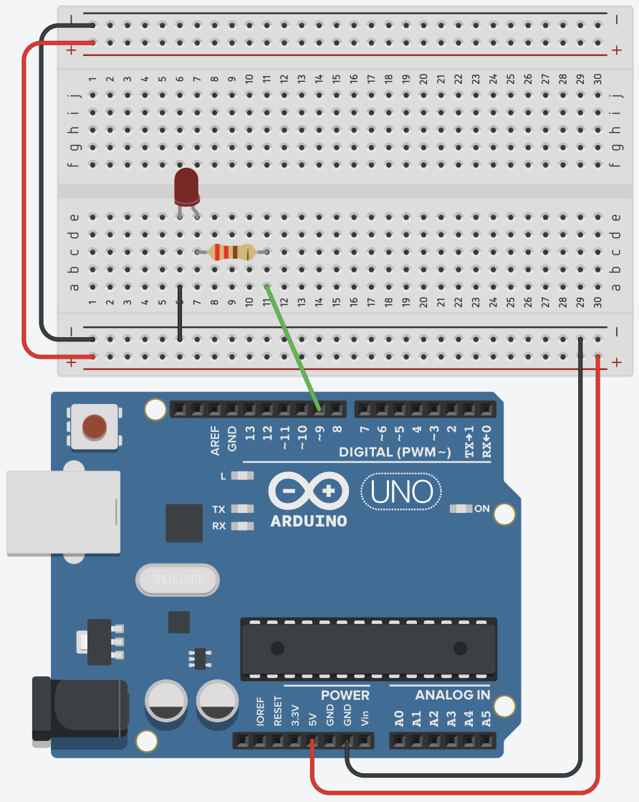

# Arduino

## What's Arduino?

Arduino is a collection of 3 tools, forming the Arduino Toolkit. First of all, there's the Arduino controller (hardware), which is available in many formats. The schematics are open source, and everybody can assemble them on their own if wanted. The second part of the Arduino Toolkit is the language and compiler. These enable you to write programs to execute by the controller. Lastly, we've got the Arduino IDE: the coding environment where you can write an Arduino program and upload to a controller.

The goal of Arduino is to enable people to easily build interactive installations, linking hardware and software together. You can read input from different kinds of sensors (push buttons, light sensors, temperature sensors, gyroscopes, distance sensors, ...) and control other electronics (leds, motors, ...)

## Installation and setup

You'll need an Arduino compatible board. You can check a list of supported boards at https://www.arduino.cc/en/Main/Products. We will be using an Arduino Micro board during this course. Next to a board, you'll need some LEDs, resistors, sensors, ...

Additionally, you'll need the Arduino IDE. Download the Arduino IDE at https://www.arduino.cc/en/Main/Software

### Hello Arduino

We'll do a first quick test of your Arduino board and the IDE. Open op the Arduino IDE. You'll be presented with a screen like the image below:


It consists of a large text area where you'll write your code, a button bar on top, a logging area below and a status bar.

We will try to blink an on-board LED on our Arduino.

1. Copy / Paste the following code into our IDE:

```c
int RXLED = 17; // on an Arduino Micro, PIN 17 is an onboard LED pin

void setup() {
  pinMode(RXLED, OUTPUT);
}

void loop() {
  digitalWrite(RXLED, HIGH);
  delay(1000);
  digitalWrite(RXLED, LOW);
  delay(1000);
}
```

2. Connect your Arduino Board on a free USB port.
3. Make sure that `Tools > Board > Arduino Micro` is selected in the menu.
4. Make sure that a port with an Arduino is selected in `Tools > Port`. The usb port with the arduino should mention something like "Arduino" at the end.
5. Click on the right-pointing arrow button to upload the Sketch to the board.

If everything works as it should, you should see the onboard LED blink on the board!



Take a look at the code from this example. The language you write Arduino code in is the C programming language. We can identify a couple of parts in this Sketch:

- `void setup()`: The code in this function only runs once at startup of the program
- `void loop()`: The code in this function runs continuously. As soon as this function exits, it runs again. You can interpret this as some sort of endless loop.
- `pinMode`: By using this function you can configure a certain pin on the arduino as either OUTPUT or INPUT. An output pin is used to drive an external component, whereas an INPUT pin is used to read a value from a pin (eg to read a sensor value).
- `digitalWrite`: We use this function to write a binary value (HIGH or LOW) to a given pin number.
- `delay`: This function pauses the execution of the program for a given amount of time in milliseconds.

## A first electrical circuit

Let's spice things up a little bit. Instead of blinking the on board LED, we'll connect a real LED to the Arduino.

To make an LED light up, it'll need electricity running through it. That electric current needs to flow from somewhere to a destination. Just like water in a rivier, it will flow from a high potential to a low potential. You'll need to be careful about the amount of current flowing through the LED at any given time. Just like with the river analogy, too much current / pressure might destroy a component (our LED). We will add a resistor to our circuit, to limit the current.

We've used a couple of terms in the paragraph above, which are expressed in different units:

- Voltage (V): the difference between the high and low potential in a circuit, expressed in Volts.
- Current (I): the amount of current flowing in a circuit, expressed in Ampere.
- Resistance (R): a resistance in a circuit, expressed in Ohms.

There is a close connection between these 3, expressed in Ohm's law. As you can read on the [Wikipedia page on Ohm's law](https://en.wikipedia.org/wiki/Ohm's_law): "Ohm's law states that the current through a conductor between two points is directly proportional to the voltage across the two points."


Where I stands for current, V for voltage and R for resistance.

### An LED in a circuit

When we want to connect an LED to an Arduino, we'd hook up the short side to a ground pin (GND) and the long side through a resistor to an output pin:



Most of the Arduino examples you'll find are shown with an Arduino UNO board. As we're using an Arduino Pro Micro board, you'll need to look for the same pin numbers or pins with the same functionality on your Arduino Pro Micro board:



We could get our hands dirty with a soldering iron, and melt wires and components together, but this would be a pretty slow prototyping / testing proces. Instead of that, we'll use a breadboard.

Breadboards make it easier to prototype electronic circuits. Make sure to [read the chapter "Anatomy of a breadboard" on the Sparkfun website](https://learn.sparkfun.com/tutorials/how-to-use-a-breadboard/#anatomy-of-a-breadboard) before continuing.

Build the circuit below using a breadboard and test the Blink example again (make sure the pin number in your code and the physical pin number match). The LED should turn on and off.



If it doesn't, check the following potential issues:

- The long connector from the LED should be connected to pin 13.
- The resistor should have a value below 1000 Ohms (1 KOhm). Resistance values can be read using the colored stripes on them (see [resistor-calculator.com](http://www.resistor-calculator.com/)). The one in the picture is a 220 Ohm resistor.

## Arduino Challenge: "Hands Free"

Build an Arduino controller for one of your recent applications (**🍎 > Recent Items > Applications**), so that you can control it without using your hands.

Our Arduino Micro's can act as a USB Keyboard / Mouse. You can check how to do this in the Arduino Examples: **File > Examples > 09. USB > KeyboardAndMouseControl**.

Try to take it further than regular small pushbuttons, build at least your own push button mechanism using aluminum foil & cardboard or use one of the analog sensors as a trigger?

```c
/*
  KeyboardAndMouseControl

  Controls the mouse from five pushbuttons on an Arduino Leonardo, Micro or Due.

  Hardware:
  - five pushbuttons attached to D2, D3, D4, D5, D6

  The mouse movement is always relative. This sketch reads four pushbuttons, and
  uses them to set the movement of the mouse.

  WARNING: When you use the Mouse.move() command, the Arduino takes over your
  mouse! Make sure you have control before you use the mouse commands.

  created 15 Mar 2012
  modified 27 Mar 2012
  by Tom Igoe

  This example code is in the public domain.

  http://www.arduino.cc/en/Tutorial/KeyboardAndMouseControl
*/

#include "Keyboard.h"
#include "Mouse.h"

// set pin numbers for the five buttons:
const int upButton = 2;
const int downButton = 3;
const int leftButton = 4;
const int rightButton = 5;
const int mouseButton = 6;

void setup() { // initialize the buttons' inputs:
  pinMode(upButton, INPUT);
  pinMode(downButton, INPUT);
  pinMode(leftButton, INPUT);
  pinMode(rightButton, INPUT);
  pinMode(mouseButton, INPUT);

  Serial.begin(9600);
  // initialize mouse control:
  Mouse.begin();
  Keyboard.begin();
}

void loop() {
  // use serial input to control the mouse:
  if (Serial.available() > 0) {
    char inChar = Serial.read();

    switch (inChar) {
      case 'u':
        // move mouse up
        Mouse.move(0, -40);
        break;
      case 'd':
        // move mouse down
        Mouse.move(0, 40);
        break;
      case 'l':
        // move mouse left
        Mouse.move(-40, 0);
        break;
      case 'r':
        // move mouse right
        Mouse.move(40, 0);
        break;
      case 'm':
        // perform mouse left click
        Mouse.click(MOUSE_LEFT);
        break;
    }
  }

  // use the pushbuttons to control the keyboard:
  if (digitalRead(upButton) == HIGH) {
    Keyboard.write('u');
  }
  if (digitalRead(downButton) == HIGH) {
    Keyboard.write('d');
  }
  if (digitalRead(leftButton) == HIGH) {
    Keyboard.write('l');
  }
  if (digitalRead(rightButton) == HIGH) {
    Keyboard.write('r');
  }
  if (digitalRead(mouseButton) == HIGH) {
    Keyboard.write('m');
  }

}
```